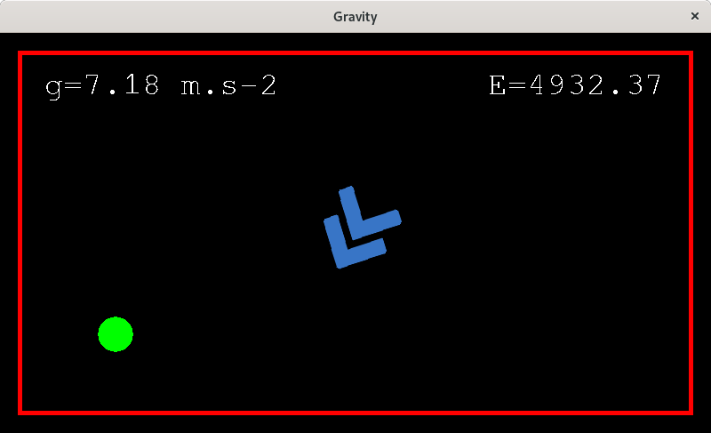

# baballe

## Screenshot

## Description
The blue arrow represents the gravity. You can rotate, increase or decrease it.

The green ball move and bounce against the wall consequently.

## What to learn there:
  - basic physic engine (Newton's laws)
  - basic shock implementation (Descartes' laws)
